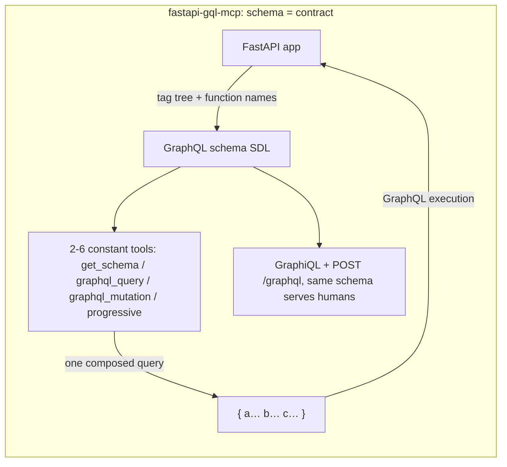

# fastapi-gql-mcp vs FastMCP.from_openapi

> **fastapi-gql-mcp 0.11.1** (this repo: FastAPI → GraphQL → MCP) vs
> **`FastMCP.from_openapi`** ([fastmcp 4](https://gofastmcp.com/servers/openapi),
> the mainstream way to expose an existing OpenAPI API as MCP tools today).
>
> Every number below is a real measurement from one machine
> (13th Gen Intel i5-13500H, 2026-10-10), not an estimate. Both sides ran on
> identical stacks — fastmcp 4.1.0, fastapi 0.143.0, the same in-memory
> client. Raw data and how to rerun everything: [bench/](./bench/).

## One-line summary

Both consume an existing FastAPI app with zero decorators.
**`from_openapi` turns each operation into a tool** — one call per endpoint,
whole payloads, generic (any OpenAPI spec, any framework). **fastapi-gql-mcp
turns the whole API into one typed query graph** — the schema is the
contract, which gives a smaller catalog at every size, composed queries in
one round trip, and field projection. `from_openapi` is the right generic
answer for non-FastAPI services; for a FastAPI app that will grow, the
GraphQL contract starts paying immediately.

## Architecture (the root difference)




Both carry your docs: `from_openapi` puts endpoint docstrings and parameter
descriptions into each tool's description and input schema; fastapi-gql-mcp
puts the same docstrings, `Field(description)` and `Query()` descriptions
into the SDL the agent reads via `get_schema`.

Tool naming: `get_note_api_notes` (operationId-derived) vs `get_note`
(under a path-derived group, e.g. `notes { mine { get_note } }`).

## Measured numbers

One shared app (`bench/shared_app.py`, a notes CRUD API). Their tools call
the app through an in-process ASGI httpx client; ours invokes routes
in-process — same no-network shape on both sides.

### Context economy — what the agent must ingest before it can act

Token estimate = JSON bytes ÷ 4.

| Routes | from_openapi catalog | gql-mcp simple (tools + SDL) | gql-mcp progressive (one domain) |
|---|---|---|---|
| 5 | 1,075 tok | **891 tok** | 1,467 tok |
| 10 | 1,823 tok | **1,039 tok** | 1,509 tok |
| 25 | 4,077 tok | **1,276 tok** | 1,509 tok |
| 50 | 7,842 tok | **1,676 tok** | 1,509 tok |
| 100 | **15,377 tok** | 2,476 tok | **1,509 tok (flat)** |

- `from_openapi` grows linearly (~153 tok/route — each tool carries its
  OpenAPI description and a full JSON Schema); at 100 routes the catalog
  alone is ~15k tokens, every session.
- gql-mcp simple is smaller at **every** measured size, and grows slowly
  (the SDL is compact); progressive stays constant — the agent fetches one
  domain fragment on demand.
- Honest counterexamples: at ~5 routes the gap is small (1,075 vs 891) and
  progressive costs MORE up front (1,467) — it pays off from ~25 routes.
  And catalog size is one dimension: `from_openapi` needs no GraphQL
  mental model at all.

### Round trips and response size

| Task (median of 3 runs) | from_openapi | fastapi-gql-mcp |
|---|---|---|
| "filtered notes + stats" | **2 tool calls = 2 agent turns**, 2.35 ms | **1 `graphql_query`**, 1.69 ms |
| same list (20 notes) | 2,285 B, whole payload | 2,341 B full / **610 B with field projection** |

### Latency (in-process microbenchmark, same client stack on both sides)

| | p50 | p95 | p50 spread over 3 runs |
|---|---|---|---|
| from_openapi, single call | 1.41 ms | 1.54 ms | 1.41–1.42 |
| gql-mcp, single query (fastmcp client) | 1.39 ms | 1.69 ms | 1.38–1.40 |

Statistically tied. Their side rebuilds an HTTP request and rides httpx;
ours runs GraphQL validation and execution — on this hardware the costs
net out within noise. Either way, real agent cost is dominated by
**turns** — each turn includes LLM reasoning, seconds at a time — so
"1 turn vs 2 turns" dwarfs a 0.02 ms gap.

## Error semantics

One request that mixes a good field (stats) with a missing id (note 9999):

**from_openapi — the whole tool call fails (raises `ToolError`):**

```text
Error calling tool 'get_note_api_notes': HTTP error 404: Not Found - {'detail': 'note not found'}

— the call raises; getting stats needs another call;
  the failure reason and the result share one text line.
```

**fastapi-gql-mcp — the bad field is isolated:**

```json
{
  "data": {
    "meta":  { "stats": { "notes": 20 } },
    "notes": { "mine": { "get_note": null } }
  },
  "errors": [{
    "message": "GET /api/notes/{note_id} -> 404: …",
    "path": ["notes", "mine", "get_note"],
    "extensions": { "code": "HTTP_404", "http_status": 404 }
  }]
}
```

## Qualitative differences

| Dimension | from_openapi | fastapi-gql-mcp |
|---|---|---|
| Tool model | one tool per operation (N tools) | 2–6 constant tools, schema is the contract |
| Works on | any OpenAPI spec, any framework, any language | FastAPI apps only (in-process) |
| Calls the API | over HTTP (httpx; remote base_url works) | in-process ASGI (zero network, real `Depends` run) |
| Scale control | route_maps / tags (flat) | domain tree + progressive disclosure (auto above 25 routes) |
| Composed queries | no — one call = one endpoint | one `graphql_query` joins domains, fields, aliases |
| Field projection | no (whole payload) | pick the fields you want |
| Error semantics | HTTP ≥400 → whole call raises | field-level null + `extensions.code`, siblings survive |
| Write gating | route_maps per method | `allow_mutation` + `mutation_include` + operation-type guards |
| Credential forwarding | client-side headers / auth per call | header whitelist (default `authorization`, cookie addable), per caller |
| Human entry point | none | GraphiQL + `POST /graphql`, same schema for humans and agents |
| Dependency pinning | part of fastmcp (actively maintained) | `fastmcp<5` upper bound, verified end to end |

## Spec note: MCP lazy tool loading (checked 2026-10)

"Lazy loading saves context" mixes four different things:

| Layer | Mechanism | Status | Saves agent context? |
|---|---|---|---|
| Core spec | `tools/list` pagination (nextCursor, since 2025-06-18) | released | **No** — pagination chunks the transport; the agent still needs the full catalog to choose |
| Core spec | `server/discover` + cacheScope (2026-07-28) | released | No — helps prompt-cache reuse, not size |
| Extension | **Tool Search** (`tools/search`: names only, full definitions on demand) | draft, needs both client and server | **Yes** — the real lazy loading |
| Library | fastmcp 4 `SearchTransform` (regex/BM25): folds the catalog into `search_tools` + `call_tool` | works today, any client (plain tools, no extension) | Yes |

What this means for the comparison, honestly:

1. `from_openapi`'s linear catalog growth is the out-of-the-box state, not
   a permanent verdict — `SearchTransform` can fold it, or the Tool Search
   extension may spread.
2. Our progressive disclosure is the same pattern as plain tools — it
   needs no extension and works with every client today.
3. Even if catalog size is fully solved by the extension later, composed
   queries, field projection, field-level error isolation and write gating
   remain GraphQL-only. Catalog size is one dimension of this comparison,
   not all of it.
4. fastmcp's `SearchTransform` stays in reserve for us — our catalog is
   already constant at 2–6 tools.

## Which one to pick

- **`from_openapi`**: the service is not FastAPI (other language, remote,
  spec-only), or it is small and stable, agents only, no composition
  needs, and you want the generic bridge with zero new concepts.
- **fastapi-gql-mcp**: it is a FastAPI app that will grow; context budget
  is tight; agents need composed views in one round trip; you need field
  projection, write gating — or humans want GraphQL too.

## Reproduce

```bash
cd comparison/bench
uv run --project env_ours   python run_ours.py     # our side
uv run --project env_theirs python run_theirs.py   # from_openapi side
python3 merge_results.py                            # merge -> results.json
```

`shared_app.py` is the one app both bridges consume. Environment,
dependency versions and run counts are recorded in `results.json`
(method block). No local clone of anything is needed — both sides install
from PyPI.

## Historical note: the fastapi-mcp (Tadata) comparison

Earlier revisions of this comparison benched
[tadata-org/fastapi_mcp](https://github.com/tadata-org/fastapi_mcp)
instead. That project has been dormant since 2025-08 (last release
v0.4.0, 2025-07; its `mcp>=1.12` pin breaks on mcp 2.x), so the live
mainstream alternative — `FastMCP.from_openapi` — replaced it as the
comparison target in 2026-10. The old numbers remain in git history.
