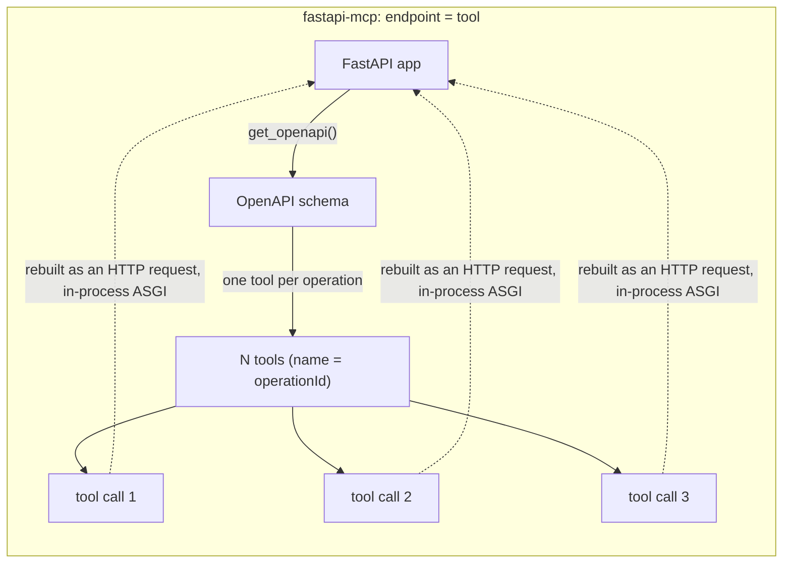
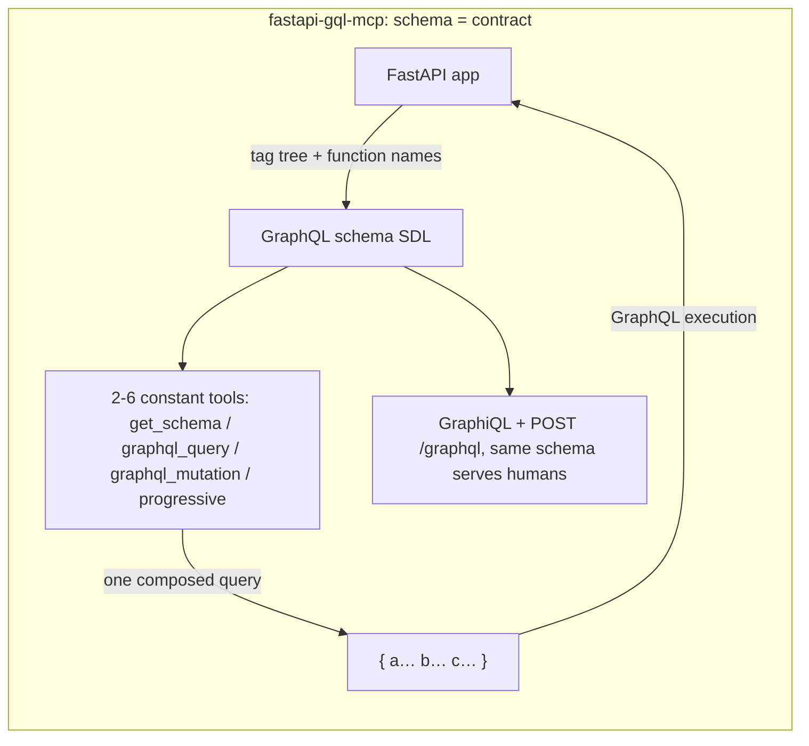

# fastapi-gql-mcp vs fastapi-mcp

> **fastapi-gql-mcp 0.4.0** (this repo: FastAPI → GraphQL → MCP) vs
> **fastapi-mcp 0.4.0** ([tadata-org/fastapi_mcp](https://github.com/tadata-org/fastapi_mcp),
> 12k stars: FastAPI → MCP, one tool per endpoint).
>
> Every number below is a real measurement from this machine (2026-10-04),
> not an estimate. Raw data and how to rerun everything: [bench/](./bench/).

## One-line summary

Both solve the same problem from different sides. **fastapi-mcp turns each
endpoint into a tool** — least setup, least mental load. **fastapi-gql-mcp
turns the whole API into one typed query graph** — the schema is the
contract, which gives constant context size and composed queries. For a
small, stable API the first is enough. As the API grows — or when you need
to save agent context, combine routes in one call, project fields, gate
writes, or offer an OAuth login — the second starts to pay off.

## Architecture (the root difference)





Description chains: fastapi-mcp carries the OpenAPI summary/description
plus a generated example response per tool. fastapi-gql-mcp carries model
docstrings → type descriptions, `Field(description)` → field descriptions,
endpoint docstrings → field descriptions, `Query()` → argument
descriptions.

Tool naming: `list_notes` (function name) vs `list_notes_api_notes_get`
(FastAPI operationId, path and method glued on).

## Measured numbers

One shared app (`bench/shared_app.py`, a notes CRUD API) wired into both
bridges, driven from two venvs (they cannot share one — fastmcp 4 requires
mcp>=2 while fastapi-mcp 0.4.0 breaks on mcp 2.x).

### Context economy — what the agent must ingest before it can act

Token estimate = JSON bytes ÷ 4.

| Routes | fastapi-mcp catalog | gql-mcp simple (tools + SDL) | gql-mcp progressive (one domain) |
|---|---|---|---|
| 5 | **685 tok (cheaper!)** | 893 tok | 1,433 tok |
| 10 | 1,219 tok | 1,040 tok | 1,475 tok |
| 25 | 2,835 tok | 1,278 tok | 1,475 tok |
| 50 | 5,542 tok | 1,678 tok | **1,476 tok (flat)** |
| 100 | **10,954 tok** | 2,478 tok | **1,476 tok (flat)** |

- fastapi-mcp grows linearly: at 100 routes the tool catalog alone is ~11k
  tokens, every session.
- gql-mcp simple grows slowly (the SDL is compact); progressive stays
  constant — the agent fetches one domain fragment on demand.
- Honest counterexample: with ~5 endpoints the one-tool-per-endpoint
  catalog is actually smaller (685 vs 893). If you have no composition
  needs, that simplicity wins.

### Round trips and response size

| Task (median of 3 runs) | fastapi-mcp | fastapi-gql-mcp |
|---|---|---|
| "filtered notes + stats" | **2 tool calls = 2 agent turns**, 1.41 ms | **1 `graphql_query`**, 1.81 ms |
| same list (20 notes) | 2,875 B, whole payload | 2,341 B full / **610 B with field projection** |

### Latency (in-process microbenchmark)

| | p50 | p95 | p50 spread over 3 runs |
|---|---|---|---|
| fastapi-mcp, single call | **0.93 ms** | 1.00 ms | 0.92–0.93 |
| gql-mcp, single query (same client stack\*) | 1.25 ms | 1.79 ms | 1.24–1.26 |

\* Same client stack on both sides: the raw mcp SDK `ClientSession`. Our
native fastmcp client measures 1.39 ms — about 0.14 ms of that is the
client itself. 200 iterations × 3 runs, medians reported.

Honest conclusion: **they are faster on a single trivial call** (no GraphQL
execution layer). But real agent cost is dominated by **turns** — each turn
includes LLM reasoning, seconds at a time — so a 1 ms gap is far smaller
than "1 turn vs 2 turns". Composition is the real time saver.

## Error semantics

One request that mixes a good field (stats) with a missing id (note 9999):

**fastapi-mcp — the whole tool call fails:**

```text
Error calling get_note_api_notes__note_id__get.
Status code: 404. Response: {"detail":"note not found"}

— the call is marked as an error; getting stats needs another call;
  the failure reason and the result share one text line.
```

**fastapi-gql-mcp — the bad field is isolated:**

```json
{
  "data": {
    "meta":  { "stats": { "notes": 20 } },
    "notes": { "mine": { "get_note": null } }
  },
  "errors": [{
    "message": "GET /api/notes/{note_id} -> 404: …",
    "path": ["notes", "mine", "get_note"],
    "extensions": { "code": "HTTP_404", "http_status": 404 }
  }]
}
```

## Qualitative differences

| Dimension | fastapi-mcp | fastapi-gql-mcp |
|---|---|---|
| Tool model | one tool per endpoint (N tools) | 2–6 constant tools, schema is the contract |
| Scale control | include/exclude operations/tags (flat) | domain tree + progressive disclosure (auto above 25 routes) |
| Composed queries | no — one call = one endpoint | one `graphql_query` joins domains, fields, aliases |
| Field projection | no (whole payload, indent=2) | pick the fields you want |
| Error semantics | HTTP ≥400 → whole call fails | field-level null + `extensions.code`, siblings survive |
| Write gating | no concept — everything is writable | `allow_mutation` + `mutation_include` + operation-type guards |
| Credential forwarding | header whitelist (default authorization) | header whitelist (default authorization, cookie etc. addable) |
| MCP endpoint auth | OAuth discovery/authorize proxies + a fake DCR; endpoint protection is your own FastAPI `Depends`; tokens are not verified | `auth=` full OAuth 2.1 proxy: DCR + PKCE + consent + reference tokens + endpoint gating |
| Transports | SSE / streamable HTTP / stdio, separate deployment | streamable HTTP (per-caller credentials need an HTTP context; stdio removed) |
| Human entry point | none | GraphiQL + `POST /graphql`, same schema for humans and agents |
| Dependency pinning | `mcp>=1.12` unbounded — crashes on mcp 2.x | `fastmcp<5` upper bound, verified end to end |
| Code size | ~2.0k LOC on the raw mcp SDK | ~2.6k LOC on graphql-core + fastmcp |

## Spec note: MCP lazy tool loading (checked 2026-10)

"Lazy loading saves context" mixes four different things:

| Layer | Mechanism | Status | Saves agent context? |
|---|---|---|---|
| Core spec | `tools/list` pagination (nextCursor, since 2025-06-18) | released | **No** — pagination chunks the transport; the agent still needs the full catalog to choose |
| Core spec | `server/discover` + cacheScope (2026-07-28) | released | No — helps prompt-cache reuse, not size |
| Extension | **Tool Search** (`tools/search`: names only, full definitions on demand) | draft, needs both client and server | **Yes** — the real lazy loading |
| Library | fastmcp 4 `SearchTransform` (regex/BM25): folds the catalog into `search_tools` + `call_tool` | works today, any client (plain tools, no extension) | Yes |

What this means for the comparison, honestly:

1. fastapi-mcp's linear catalog growth is the out-of-the-box state, not a
   permanent verdict — they can build search folding themselves, or wait
   for the Tool Search extension to spread.
2. Our progressive disclosure is the same pattern as plain tools — it needs
   no extension and works with every client today.
3. Even if catalog size is fully solved by the extension later, composed
   queries, field projection, field-level error isolation and write gating
   remain GraphQL-only. Catalog size is one dimension of this comparison,
   not all of it.
4. fastmcp's `SearchTransform` stays in reserve for us — our catalog is
   already constant at 2–6 tools.

## Which one to pick

- **fastapi-mcp**: few endpoints (~10 or less) and stable, agents only, no
  composition needs, want the fastest possible setup, auth already covered
  by FastAPI dependencies.
- **fastapi-gql-mcp**: the API will grow; context budget is tight; agents
  need composed views in one round trip; you need field projection, write
  gating, a full OAuth login experience — or humans want GraphQL too.

## Reproduce

Prerequisite: clone the other repo next to this one (`env_theirs` points
at it with a path dependency):

```bash
gh repo clone tadata-org/fastapi_mcp ../fastapi-mcp
cd Comparison/bench
uv run --project env_ours   python run_ours.py     # our side
uv run --project env_theirs python run_theirs.py   # fastapi-mcp side
python3 merge_results.py                            # merge -> results.json
```

`shared_app.py` is the one app both bridges consume — it is also the
"bridge the two frameworks" code itself. Environment, dependency versions,
run counts and the competitor's exact commit are recorded in
`results.json` (method block).
